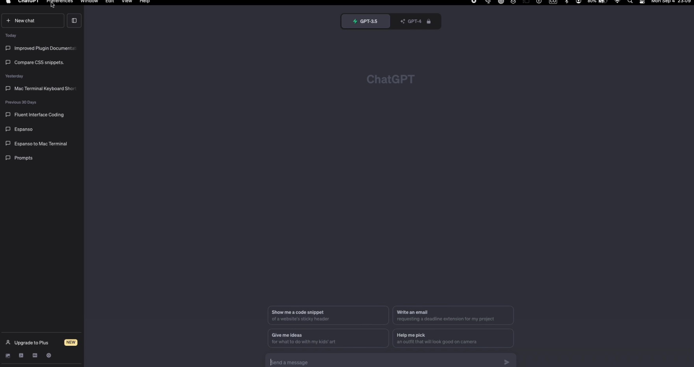
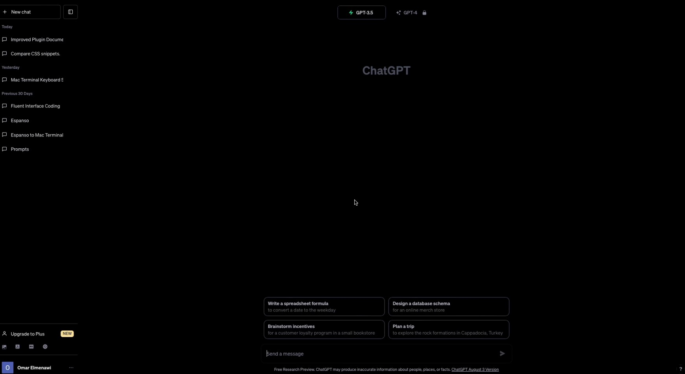

## Overview 

> :star: This project involves implementing a custom CSS styling to achieve a fully dark mode for the Desktop ChatGPT application by [lencx (lencx) (github.com)](https://github.com/lencx). The goal is to transform the default appearance, replacing gray shades with a sleek and consistent black color scheme.

## Results 

### Before 



### After 


## Code Implementation

### Function: `injectCSS(css)`

```javascript
function injectCSS(css) {
  var style = document.createElement('style');
  style.type = 'text/css';
  style.appendChild(document.createTextNode(css));
  document.head.appendChild(style);
}

var cssSnippet = `
div {
    background-image: linear-gradient(to bottom, black, black) !important; 
    background-color: black !important;
}

button {
    background-color: black !important;  
}

a {
    background-color: black !important;
}

h3 {
    background-color: black !important;
    border: 1px solid royalblue;
}

#chatgpt-app-window-top {
    background-color: black !important;
    background-image: black !important;
}
`;

injectCSS(cssSnippet);
```

The custom CSS code snippet defines styling rules to achieve the desired dark mode appearance:

- `div`: Sets the background color and image to black.
- `button`: Sets the background color to black.
- `a`: Sets the background color to black.
- `h3`: Sets the background color to black and adds a royal blue border.
- `#chatgpt-app-window-top`: Sets the background color and image to black for the application window's top section.

## Usage

To apply this dark mode styling to the Desktop ChatGPT application, execute the `injectCSS` function with the provided CSS snippet. Follow these instructions in the video 

![[Desktop ChatGPT Dark Mode Styling Steps.mov]]

1. Open Control Centre
	1. 
3. Go to Scripts and click edit next to `main.js`
	1. 
4. You should see this `main.js`
	1. 
5. Insert the complete snippet above into the `main.js` 
	1. 
6. Save.
	1. 
7. Reload.
	1. 


> :warning: Do not delete any pre-existing code in the `main.js` file. Just insert the snipped below it.

## Conclusion

By implementing this custom CSS styling, the Desktop ChatGPT application can achieve a visually appealing and user-friendly dark mode, providing a comfortable and consistent user experience in low-light conditions.

For any further adjustments or enhancements, refer to the CSS code and the `injectCSS` function as needed.
